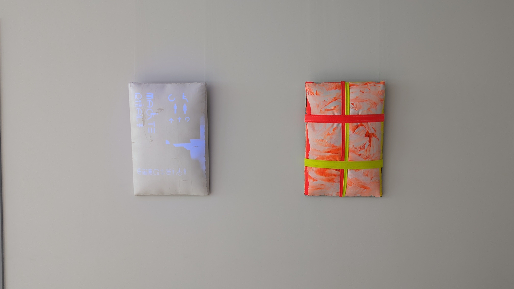

# Kunst und Krebs

[](https://www.youtube.com/watch?v=xE2tcexrAlM)
[](https://www.youtube.com/watch?v=xE2tcexrAlM)

See [here](https://www.youtube.com/watch?v=xE2tcexrAlM) for a video of the exhibition.

The project files for lighting as part of the Kunst und Krebs exhibition, installed in NCT Dresden from 2023-2024.
This consists of:

* bill of materials for the hardware
* software used in modulation

The goal of this lighting is to:

* provide sufficient UV (395nm) illumination of the piece to generate visible amounts of fluorescence under normal lighting conditions
* modulate the amount of fluorescence generated to match a chosen pattern.
In this case we are emulating the cadence of human breathing

## Overview
See the `doc/` folder for all part documentation, system bill of materials, and photos of the completed system.

## Electronics
We built the lighting around LED modules from Thorlabs and an Arduino Nano for modulation.

The intended connection is:

* LEDD1B 0 -> GND, Pin 10
* LEDD1B 1 -> GND, Pin 11

Once programmed, the Nano can be powered and will automatically run the program.

## Developers
The Arduino code can be built and deployed using the Arduino IDE (https://www.arduino.cc/en/software/).
Follow the instructions at that URL to get started on your platform.

The main code is in `breathe/` and consists of:
* `breathe.ino`, which sets the output of the two LEDs based on a look-up table
* `make_signal.py`, which produces the look-up table in `breath.h`

The dependencies for the Python code are given in `requirements.txt`. 
You can build the look-up table by:
```
python3 -m venv venv
source venv/bin/activate
pip install -r requirements.txt
cd breathe
python make_signal.py
```

### Tools for assembly
To make modifications you will need the following:

* #2 Phillips tip screwdriver
* Thorlabs adjustable spanner wrench (SPW801)
* half-round file
* box knife
* metric hex wrench set (minimum: 1.2mm, 5mm)

## Press

* [Announcement](https://tu-dresden.de/kustodie/die-einrichtung/aktuelles/news/kunst-und-krebs-ausschreibung-fuer-meisterschueler-innen-der-hfbk-dresden)
* [Project page](https://www.nct-dresden.de/das-nctucc-dresden/newsroom/veranstaltungen/ausstellung-kunst-und-krebs.html)

